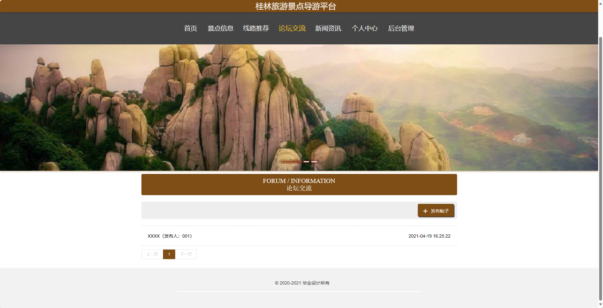
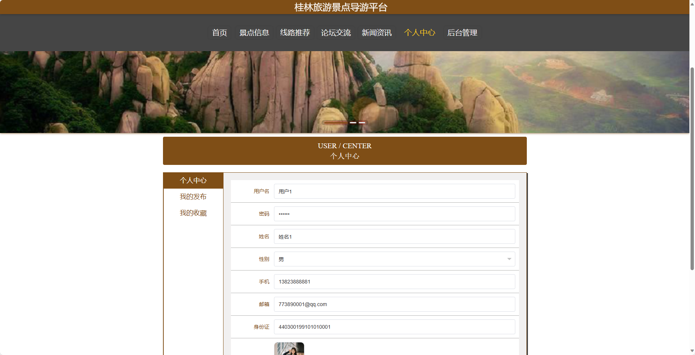
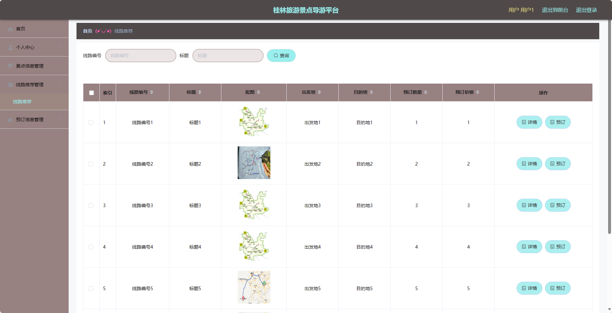

基于SpringBoot的桂林旅游景点导游平台（程序+论文）
=
- 完整代码获取地址：从戎源码网 ([https://armycodes.com/](https://armycodes.com/))
- 作者微信：19941326836  QQ：952045282 
- 承接计算机毕业设计、Java毕业设计、Python毕业设计、深度学习、机器学习
- 选题+开题报告+任务书+程序定制+安装调试+论文+答辩ppt 一条龙服务

一、项目介绍
---
基于Spring Boot框架实现的桂林旅游景点导游平台，系统包含两种角色：管理员、用户,系统分为前台和后台两大模块，主要功能如下。
### 前台：
1. 首页：展示导游平台的基本信息和推荐景点、线路等内容。
2. 景点信息：提供各个景点的详细信息，包括景点介绍、地址、交通方式等。
3. 线路推荐：推荐游览桂林的线路，包括线路介绍、景点安排、费用等。
4. 论坛交流：提供用户之间的交流平台，可以分享旅游经验、提问问题等。
5. 新闻资讯：发布最新的旅游资讯和桂林相关新闻。
6. 个人中心：用户可以查看和编辑个人信息，包括个人资料、订单记录等。

### 后台：
### 管理员：
1. 个人中心：管理员可以管理自己的个人信息和权限。
2. 用户管理：对用户信息进行管理，包括添加、修改和删除用户信息。
3. 景点类型管理：管理景点的类型，包括添加、修改和删除景点类型。
4. 景点信息管理：管理景点的详细信息，包括添加、修改和删除景点信息。
5. 线路推荐管理：管理线路推荐的信息，包括添加、修改和删除线路推荐。
6. 预订信息管理：管理用户的预订信息，包括查看和处理预订请求。
7. 论坛交流：管理员可以管理论坛交流区，包括审核和删除帖子。
8. 系统管理：管理系统的参数设置和日志记录。

用户：
1. 个人中心：用户可以查看和编辑个人信息。
2. 景点信息管理：用户可以查看各个景点的详细信息。
3. 线路推荐管理：用户可以查看推荐的线路信息。
4. 预订信息管理：用户可以查看已预订的线路信息和处理预订请求。

二、项目技术
---
- 编程语言：Java
- 数据库：MySQL
- 项目管理工具：Maven
- 前端技术：VUE、HTML、Jquery、Bootstrap
- 后端技术：Spring、SpringMVC、MyBatis

三、运行环境
---
- 操作系统：Windows、macOS都可以
- JDK版本：JDK1.8以上都可以
- 开发工具：IDEA、Ecplise、Myecplise都可以
- 数据库: MySQL5.7以上都可以
- Tomcat：任意版本都可以
- Maven：任意版本都可以

四、运行截图
---
### 论文截图：

### 程序截图：

